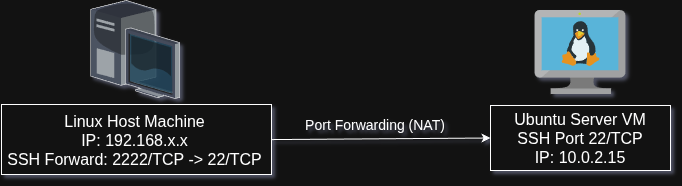
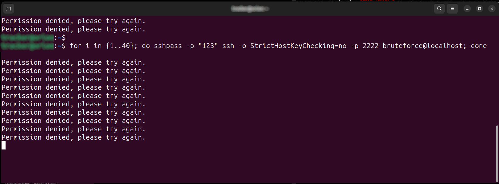
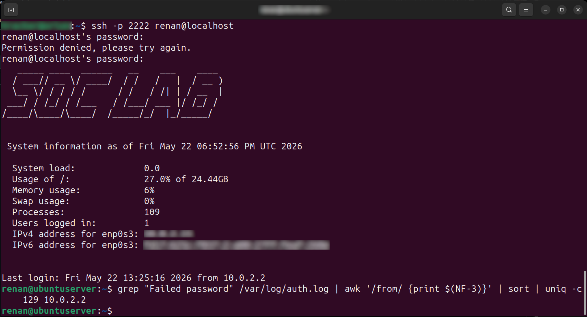

# SSH Log Analysis Lab - Ubuntu Server

<p align="center">
  
  
  
</p>

---

# Overview

This project was created to simulate and investigate SSH authentication events inside a controlled Linux laboratory environment.

The lab focuses on practical cybersecurity concepts involving:
- SSH remote access
- NAT and Port Forwarding
- Brute force simulation
- Authentication log analysis
- Basic incident investigation
- Linux administration fundamentals

---

# Lab Architecture



---

# Environment

- Oracle VirtualBox
- Ubuntu Server 24.04 LTS
- NAT Networking
- OpenSSH Server
- Linux Host Machine

---

# Virtual Machine Configuration

| Resource | Configuration |
|---|---|
| RAM | 4 GB |
| vCPUs | 2 |
| Storage | 25 GB |
| Network Mode | NAT |
| SSH | Enabled |

---

## SSH Service Verification

```bash
systemctl status ssh
```

## Active Ports and Listening Services

```bash
ss -tulnp
```

This verification confirmed that the SSH service was actively listening on port `22/TCP`.

---

# NAT and Port Forwarding Configuration

The virtual machine was configured using NAT mode inside VirtualBox.

In this model, the VM can access external networks normally, but inbound external connections are blocked by default.

During the initial tests, direct SSH access failed even with the SSH service running correctly.

This happened because VirtualBox NAT acts as an intermediary layer between the host machine and the virtual machine.

To allow remote SSH access, a manual port forwarding rule was created.

## Port Forwarding Rule

| Setting | Value |
|---|---|
| Name | SSH |
| Protocol | TCP |
| Host Port | 2222 |
| Guest Port | 22 |

With this configuration, every connection received on port `2222/TCP` of the Linux host is redirected to port `22/TCP` of the Ubuntu Server VM.

---

# Remote SSH Access

SSH remote access was performed using:

```bash
ssh -p 2222 renan@localhost
```

During the first SSH connection, the server fingerprint was displayed for manual identity verification.

---

# Fingerprint Validation

```bash
ssh-keygen -lf /etc/ssh/ssh_host_ed25519_key.pub
```

Example output:

```text
SHA256:9erhtOk9RbXSJ73Jl8GYIjhfXSBnipGBOsw/totRc
```

After validation, the host machine automatically stored the server fingerprint inside the `known_hosts` file for future trusted connections.

This mechanism helps prevent Man-in-the-Middle attacks by validating server identity during SSH authentication.

---

# Brute Force Simulation

After configuring remote access, automated invalid authentication attempts were generated to simulate brute force behavior.

The simulation was executed using a Bash loop combined with `sshpass`.

## Attack Simulation



```bash
for i in {1..40}; do sshpass -p "123" ssh -o StrictHostKeyChecking=no -p 2222 bruteforce2@localhost; done
```

The objective was to generate real authentication failures for later investigation and event correlation.

During the simulation, the server generated events such as:
- Failed password
- Invalid user
- Permission denied

---

## IP Correlation and Counting



```bash
grep "Failed password" /var/log/auth.log | awk '/from/ {print $(NF-3)}' | sort | uniq -c
```

Example output:

```text
129 10.0.2.2
```

The IP `10.0.2.2` corresponds to the internal NAT interface created by VirtualBox.

This occurs because the SSH connections originate from the Linux host and are internally translated through the VirtualBox NAT network.


---

# Concepts Practiced

- SSH Remote Access
- NAT Networking
- Port Forwarding
- Linux Authentication
- Fingerprint Validation
- Authentication Logs
- Brute Force Simulation
- Log Correlation
- Basic Incident Investigation

---

# Skills Demonstrated

- Linux Administration Basics
- SSH Configuration
- Network Troubleshooting
- Authentication Log Analysis
- Security Event Investigation
- Basic SOC Workflow

---

# Future Improvements

- Fail2Ban integration
- Firewall hardening
- SIEM integration
- Multiple attacker simulation
- Automated alert generation
- Dashboard visualization
- Detection rule creation
- SSH hardening
- Incident response workflow

---

# Conclusion

This laboratory provided practical experience with:
- Linux server administration
- SSH remote access
- NAT networking
- Brute force simulation
- Authentication monitoring
- Log analysis
- Event correlation

The project also reinforced core cybersecurity concepts related to:
- remote administration,
- authentication visibility,
- network isolation,
- log investigation,
- and basic SOC operational workflows.
