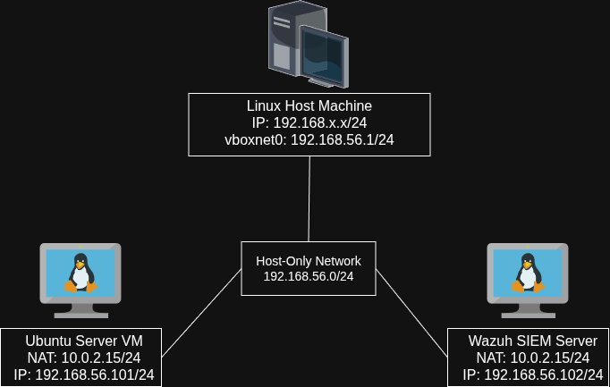
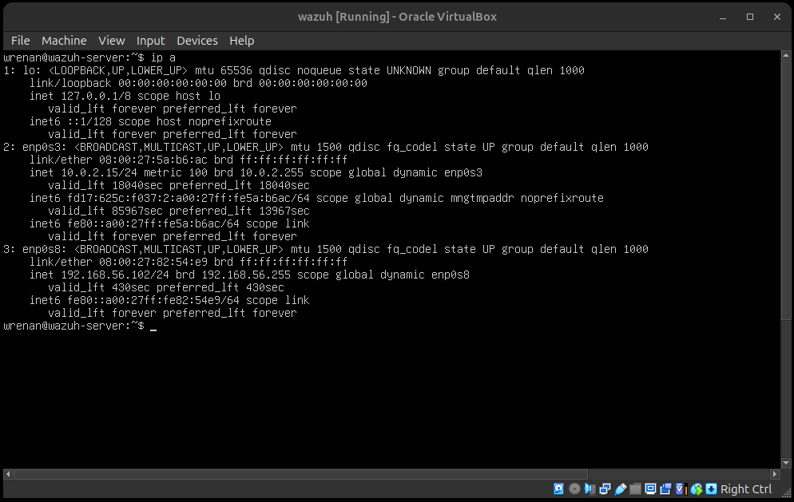
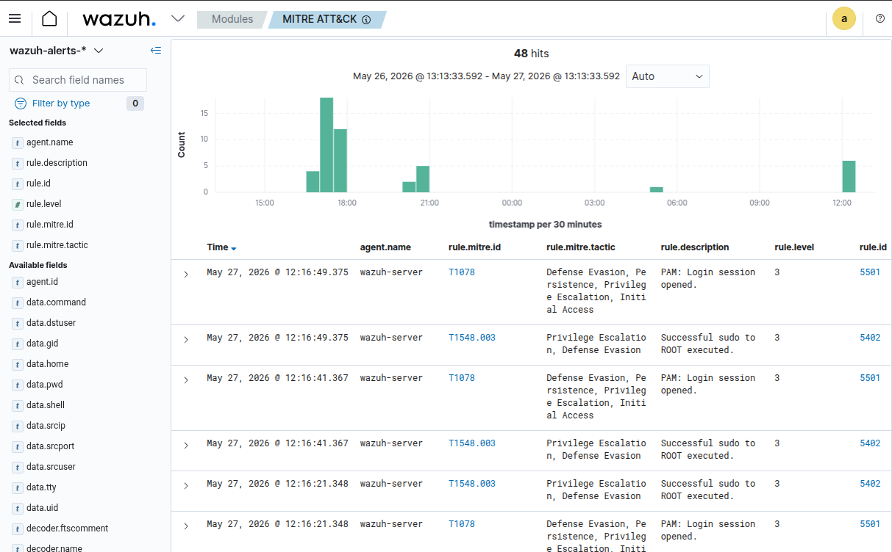
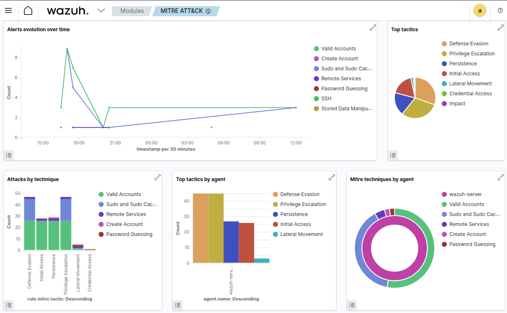
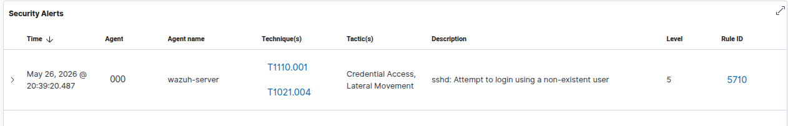

# Wazuh SIEM Integration Lab

## Objective

This stage of the laboratory focused on introducing SIEM concepts using Wazuh in a segmented virtualized environment.

The goal was to:

* Separate monitoring infrastructure from the monitored target;
* Simulate a small LAN with multiple hosts;
* Install and configure a SIEM platform;
* Deploy an agent on the monitored server;
* Centralize logs and security events;
* Observe SSH and system activity through the Wazuh Dashboard.

---

# Updated Topology

At this point, the environment contains:

* Host machine;
* Ubuntu target server;
* Dedicated Wazuh SIEM server;
* Host-Only network for internal communication;
* NAT network for internet access.

## Current Architecture



---

# Creating the Wazuh Server VM

A second Ubuntu Server virtual machine was created to host the SIEM infrastructure.

Recommended configuration:

* 4 GB RAM;
* 2 CPUs;
* Adapter 1: NAT;
* Adapter 2: Host-Only Adapter (`vboxnet0`).

The VM was configured similarly to the original Ubuntu server.

---

# Configuring the Host-Only Interface

After installation, the second interface (`enp0s8`) initially appeared in a `DOWN` state and without an IPv4 address.

This was resolved manually.

## Bringing the Interface Up

```bash
sudo ip link set enp0s8 up
```

## Requesting an IPv4 Address via DHCP

```bash
sudo dhclient enp0s8
```

## Verifying the Interface

```bash
ip a
```

Expected result:

```text
192.168.56.102
```



> Important observation:
>
> `ip link set` and `dhclient` are temporary runtime configurations.
> After rebooting the machine, the interface returned to the `DOWN` state again.
>
> Persistent network configuration should later be implemented using Netplan.

---

# Installing Wazuh

The Wazuh stack was installed directly on the dedicated Ubuntu Server VM.

## Updating the System

```bash
sudo apt update && sudo apt upgrade -y
```

## Installing Required Packages

```bash
sudo apt install curl apt-transport-https unzip -y
```

## Downloading the Installer

```bash
curl -O https://packages.wazuh.com/4.7/wazuh-install.sh
```

## Making the Script Executable

```bash
chmod +x wazuh-install.sh
```

## Installing the Full Stack

```bash
sudo ./wazuh-install.sh -a
```

The installation deployed:

* Wazuh Manager;
* Wazuh Indexer;
* Wazuh Dashboard.

---

# Verifying Wazuh Services

After installation, the services were validated using:

```bash
sudo systemctl status wazuh-manager
```

```bash
sudo systemctl status wazuh-dashboard
```

```bash
sudo systemctl status wazuh-indexer
```

Expected status:

```text
active (running)
```

---

# Accessing the Dashboard

The Wazuh Dashboard became accessible through HTTPS.

## Dashboard Address

```text
https://192.168.56.102
```

or explicitly:

```text
https://192.168.56.102:443
```

The browser displayed a self-signed certificate warning, which was accepted for laboratory purposes.

---

# Recovering the Dashboard Credentials

The installation generated credentials automatically.

The credentials file was extracted using:

```bash
sudo tar -axf wazuh-install-files.tar wazuh-install-files/wazuh-passwords.txt -O
```

---

# Installing the Wazuh Agent on the Target Server

The original Ubuntu target server (`192.168.56.101`) was configured as a monitored endpoint.

## Adding the Wazuh Repository

```bash
curl -s https://packages.wazuh.com/key/GPG-KEY-WAZUH | sudo gpg --dearmor -o /usr/share/keyrings/wazuh.gpg
```

```bash
echo "deb [signed-by=/usr/share/keyrings/wazuh.gpg] https://packages.wazuh.com/4.x/apt/ stable main" | sudo tee /etc/apt/sources.list.d/wazuh.list
```

## Updating the Package List

```bash
sudo apt update
```

## Installing the Agent

```bash
WAZUH_MANAGER="192.168.56.102" sudo apt install wazuh-agent -y
```

---

# Troubleshooting the Agent

The Wazuh Agent service initially failed to start.

The issue was diagnosed using:

```bash
sudo systemctl status wazuh-agent
```

and:

```bash
sudo journalctl -xeu wazuh-agent.service
```

The logs revealed that the agent attempted to connect to:

```text
MANAGER_IP
```

instead of the actual Wazuh Server IP.

This happened because the installation variable had not been properly substituted.

---

# Fixing the Agent Configuration

The configuration file was edited:

```bash
sudo nano /var/ossec/etc/ossec.conf
```

The incorrect address:

```xml
<address>MANAGER_IP</address>
```

was replaced with:

```xml
<address>192.168.56.102</address>
```

After correction:

```bash
sudo systemctl restart wazuh-agent
```

The service successfully started.

---

# Registering the Agent

Even after the service was active, the Dashboard still showed:

```text
No agents available
```

This demonstrated an important concept:

> Service active does not necessarily mean integration is complete.

The agent still needed to be registered with the Wazuh Manager.

---

# Registering the Agent on the Manager

On the Wazuh Server:

```bash
sudo /var/ossec/bin/manage_agents
```

The following steps were executed:

1. Add agent;
2. Agent name:

```text
ubuntu_server
```

3. Agent IP:

```text
192.168.56.101
```

4. Export the generated key.

---

# Importing the Key on the Target Server

On the monitored Ubuntu Server:

```bash
sudo /var/ossec/bin/manage_agents
```

The generated key was imported manually.

Afterwards:

```bash
sudo systemctl restart wazuh-agent
```

The agent successfully connected to the Manager.

---

# Observing Events in the Dashboard

Once the agent became active, the Dashboard started receiving events from the monitored machine.

Observed event categories included:

* SSH activity;
* PAM login sessions;
* Authentication events;
* System access;
* User session creation and closure.

The Wazuh Dashboard also mapped events to MITRE ATT&CK techniques.

Examples observed:

* Credential Access;
* Lateral Movement.





---

# Understanding Wazuh Alert Levels

Wazuh assigns severity levels to events.

Example:

```text
Level 5
```



represents moderate suspicious activity.

A login attempt using a non-existent SSH user generated a Level 5 event because it may indicate:

* enumeration;
* brute-force attempts;
* automated scanning.

Lower-severity events, such as normal PAM session creation, appeared as Level 3.

This demonstrated an important SIEM concept:

> Not every event is an attack.
>
> SIEM platforms attempt to prioritize events according to operational relevance.

---

# Key Concepts Learned

During this stage, the following concepts were explored:

* SIEM architecture;
* Centralized logging;
* Wazuh ecosystem;
* Manager vs Agent distinction;
* Dashboard visualization;
* Event ingestion;
* Agent registration;
* Host-Only networking;
* Runtime vs persistent network configuration;
* MITRE ATT&CK mapping;
* Event severity classification;
* Distributed monitoring architecture.

---

# Final Notes

This stage marked a major transition in the laboratory.

Before Wazuh, logs were analyzed manually using:

```bash
tail -f /var/log/auth.log
```

After SIEM integration, the environment evolved into a centralized monitoring architecture capable of:

* aggregating events;
* classifying alerts;
* correlating activity;
* visualizing behavior;
* supporting future offensive testing.

This structure will later support:

* Kali Linux integration;
* controlled attacks;
* web application testing;
* HTTPS services;
* database-backed applications;
* more advanced detection scenarios.
