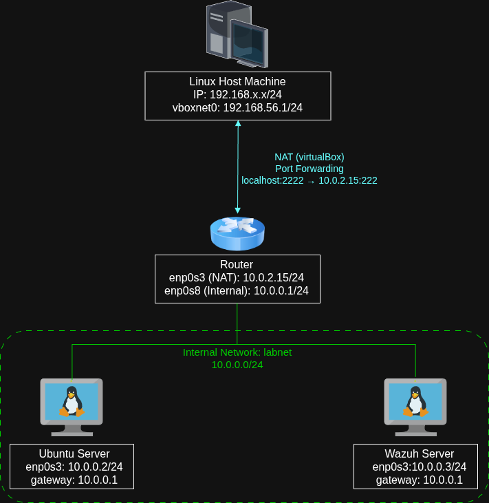
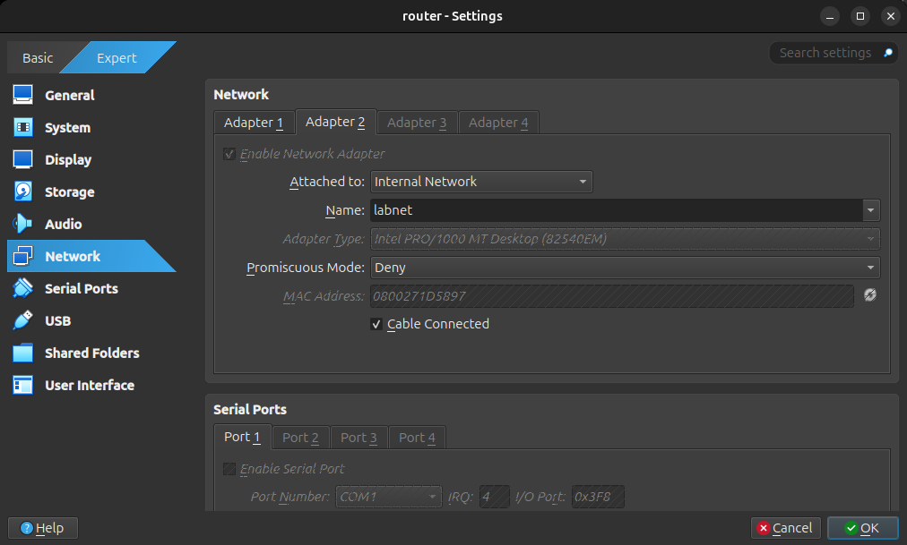
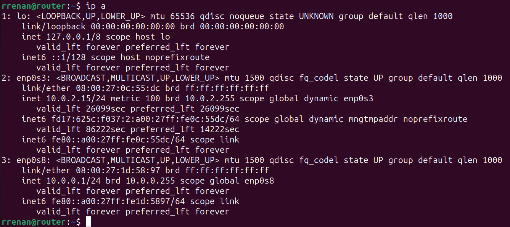

# Linux Router Implementation and Network Segmentation in the Wazuh Lab

## Objective

Expand the initial Wazuh lab architecture by adding a dedicated Linux router responsible for routing between internal networks and providing external internet access through NAT, creating a structure closer to real-world environments.

---

# Network Topology

The architecture now uses three main virtual machines:

* Ubuntu Server
* Linux Router
* Wazuh SIEM

Communication between the machines occurs through a VirtualBox Internal Network.

## Topology Representation



---

# VirtualBox Adapter Configuration

## Router

### Adapter 1

* NAT
* Responsible for internet access

### Adapter 2

* Internal Network
* Network name:

```text id="q7m2vx"
labnet
```



---

## Ubuntu Server

### Adapter 1

* Internal Network
* Network name:

```text id="x4w8np"
labnet
```

---

## Wazuh SIEM

### Adapter 1

* Internal Network
* Network name:

```text id="m1q9vc"
labnet
```

---

# Linux Router Configuration

The router was configured using Netplan.

Configuration file:

```bash id="r8x2np"
sudo nano /etc/netplan/50-cloud-init.yaml
```

Configuration used:

```yaml id="k4w7tn"
network:
  version: 2
  ethernets:
    enp0s3:
      dhcp4: true

    enp0s8:
      addresses:
        - 10.0.0.1/24
```

Apply configuration:

```bash id="z1m9qc"
sudo netplan apply
```

Verification:

```bash id="p7x2mc"
ip a
```



---

# Ubuntu Server Configuration

Configuration file:

```bash id="v8m2qp"
sudo nano /etc/netplan/50-cloud-init.yaml
```

Configuration:

```yaml id="k4w7rv"
network:
  version: 2
  ethernets:
    enp0s3:
      addresses:
        - 10.0.0.2/24

      routes:
        - to: default
          via: 10.0.0.1

      nameservers:
        addresses:
          - 8.8.8.8
```

Apply configuration:

```bash id="r1m9qc"
sudo netplan apply
```

Verification:

```bash id="q7m2vx"
ip a
ip r
```

---

# Wazuh SIEM Configuration

Configuration file:

```bash id="x4w8np"
sudo nano /etc/netplan/50-cloud-init.yaml
```

Configuration:

```yaml id="m1q9vc"
network:
  version: 2
  ethernets:
    enp0s3:
      addresses:
        - 10.0.0.3/24

      routes:
        - to: default
          via: 10.0.0.1

      nameservers:
        addresses:
          - 8.8.8.8
```

Apply configuration:

```bash id="r8x2np"
sudo netplan apply
```

---

# Enabling IP Forwarding

The Linux router needed to forward packets between different networks.

Configuration file:

```bash id="k4w7tn"
sudo nano /etc/sysctl.conf
```

Modified line:

```bash id="z1m9qc"
net.ipv4.ip_forward=1
```

Apply changes:

```bash id="p7x2mc"
sudo sysctl -p
```

---

# NAT Configuration (MASQUERADE)

Install iptables:

```bash id="v8m2qp"
sudo apt install iptables -y
```

Apply NAT rule:

```bash id="k4w7rv"
sudo iptables -t nat -A POSTROUTING -o enp0s3 -j MASQUERADE
```

This rule allows internal machines to use the router's external IP address to access the internet.

---

# Connectivity Tests

## Internal Communication

Test communication between Ubuntu Server and Router:

```bash id="r1m9qc"
ping 10.0.0.1
```

Test communication between Ubuntu Server and Wazuh:

```bash id="q7m2vx"
ping 10.0.0.3
```

---

## External Communication

Internet connectivity test:

```bash id="x4w8np"
ping 8.8.8.8
```

The test succeeded after:

* enabling IP forwarding;
* configuring MASQUERADE.

---

# Troubleshooting

## `enp0s8` Interface DOWN

Problem:

```text id="m1q9vc"
state DOWN
```

Cause:

* the Internal Network adapter had not been properly added in VirtualBox.

Solution:

* add the second adapter;
* configure it as:

```text id="r8x2np"
Internal Network
```

* use the same network name:

```text id="k4w7tn"
labnet
```

---

## `networking.service` Not Found

Error:

```bash id="z1m9qc"
Failed to restart networking.service:
Unit networking.service not found.
```

Cause:

* modern Ubuntu versions use Netplan;
* `/etc/network/interfaces` is no longer the default method.

Solution:

* apply network changes using:

```bash id="p7x2mc"
sudo netplan apply
```

---

## Connectivity Loss After Incorrect Adapter Modification

Problem:

* accidental removal of the main NAT adapter;
* VM lost internet access.

Solution:

* restore:

```text id="v8m2qp"
Adapter 1 -> NAT
```

* move the internal network to:

```text id="k4w7rv"
Adapter 2
```

---

## Wazuh VM Boot Issue

Symptom:

* VM appeared stuck during boot.

Solution:

* wait for the full initialization process;
* validate network configuration;
* reboot the VM after correcting network settings.

---

## Administrative Access from Host Machine

After isolating the internal network behind the custom Linux router, direct access from the host machine to the internal virtual machines was no longer possible. This behavior is expected because the `Internal Network` mode in VirtualBox isolates communication exclusively between VMs connected to the same internal segment.

At this stage, the router started behaving similarly to a real network gateway, where internal hosts are protected behind a private subnet and are not directly exposed to external devices.

To maintain administrative access while preserving network segmentation, SSH access was configured through a controlled Port Forwarding rule in VirtualBox.

### Why Direct Access Stopped Working

Initially, the virtual machines were connected through a `Host-Only Adapter`, allowing the host operating system to communicate directly with the VMs.

After migrating to a routed topology using `Internal Network`, the host machine was no longer part of the `10.0.0.0/24` subnet. As a result:

* The host could not ping internal machines directly.
* SSH connections to internal IP addresses failed.
* Internal hosts became reachable only through the router.

This behavior closely resembles real-world segmented network architectures.

---

## SSH Access Through Port Forwarding

To securely administer the environment from the host machine without exposing the entire internal network, a Port Forwarding rule was created on the Router VM NAT interface.

The forwarding rule redirects connections from the host machine to the router's SSH service.

### VirtualBox NAT Port Forwarding Configuration

The following rule was configured under:

`VirtualBox → Router VM → Settings → Network → Adapter 1 (NAT) → Port Forwarding`

The `Guest IP` field was intentionally left blank because the forwarding targets the VM itself.

---


---

After applying the forwarding rule, SSH access became available from the host machine using:

```bash
ssh username@localhost -p 2222
```

In this setup:

* `localhost` refers to the host operating system itself.
* VirtualBox intercepts connections arriving at port `2222`.
* The connection is then forwarded internally to the Router VM SSH service on port `22`.

This architecture preserves the isolation of the internal network while still allowing secure administrative access.

---

## Accessing Internal Machines Through the Router

Once connected to the router through SSH, internal machines became reachable directly from the router itself.

Example:

```bash
ssh username@10.0.0.2
```

This approach resembles a simplified bastion/jump-host architecture commonly used in real-world environments.

The router now acts as a controlled administrative gateway between the host machine and the isolated internal network.

---

## Troubleshooting

### Internal Machines Reachable but No Internet Access

If internal hosts can reach the router but cannot access external networks, verify:

* IP forwarding status
* NAT/MASQUERADE rule
* Default gateway configuration

Check if IP forwarding is enabled:

```bash
cat /proc/sys/net/ipv4/ip_forward
```

Expected output:

```bash
1
```

If disabled:

```bash
sudo sysctl -w net.ipv4.ip_forward=1
```

Verify NAT rules:

```bash
sudo iptables -t nat -L -n -v
```

If the MASQUERADE rule is missing:

```bash
sudo iptables -t nat -A POSTROUTING -o enp0s3 -j MASQUERADE
```

---

### SSH Warning: REMOTE HOST IDENTIFICATION HAS CHANGED

After rebuilding the network topology or changing Port Forwarding targets, SSH may display:

```text
WARNING: REMOTE HOST IDENTIFICATION HAS CHANGED!
```

This occurs because SSH stores the cryptographic fingerprint of previously accessed hosts inside the `known_hosts` file.

When the machine responding behind `localhost:2222` changes, SSH detects that the host identity no longer matches the previously stored fingerprint.

To remove the outdated key:

```bash
ssh-keygen -f "/home/<user>/.ssh/known_hosts" -R "[localhost]:2222"
```

After removing the old fingerprint, reconnect:

```bash
ssh username@localhost -p 2222
```

SSH will request confirmation for the new host identity before saving the updated fingerprint.

---

# Concepts Practiced During the Lab

The implementation reinforced several important networking concepts:

* Gateway
* NAT
* MASQUERADE
* IP Forwarding
* Network Segmentation
* Internal Network
* DHCP
* Static IP Addressing
* CIDR Notation
* Netmask
* Interface Troubleshooting
* Routing
* Inter-network Communication
* Private vs Public Networks
* SSH Administrative Access
* Port Forwarding
* Bastion/Jump Host Architecture
* Controlled Access Through NAT
* Host-to-Internal-Network Communication Through a Router

The lab also reinforced the relationship between packet forwarding, NAT translation and secure administrative access in segmented environments.

---

# Conclusion

The Linux router implementation transformed the original Wazuh environment into a more realistic network architecture by introducing routing, NAT and network segmentation concepts.

Beyond the practical setup, the lab also reinforced understanding of packet flow, gateways, routing behavior, inter-network communication and Linux network troubleshooting.

As the topology evolved, the environment also introduced concepts commonly found in real-world infrastructures, such as controlled SSH administrative access through Port Forwarding and bastion-style access through a centralized router.

Instead of exposing internal machines directly to the host system, the router became an intermediary administrative gateway, preserving internal network isolation while still allowing secure management access.

This final architecture provided practical exposure not only to Linux networking fundamentals, but also to concepts directly related to infrastructure administration, defensive security and segmented network design.
