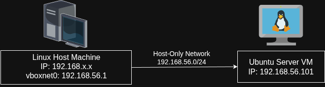
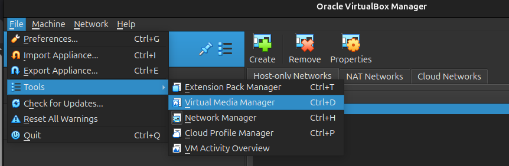
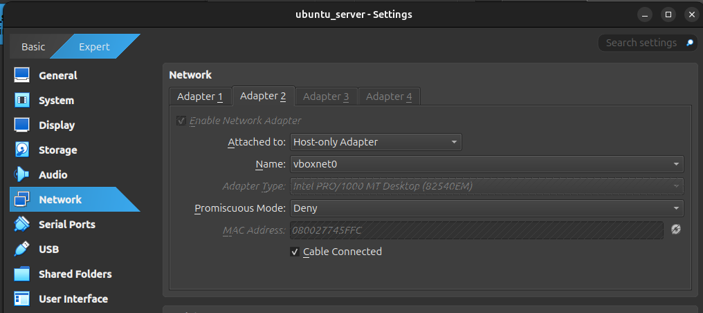
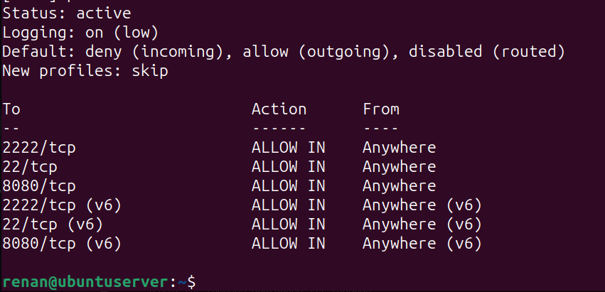
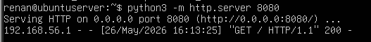
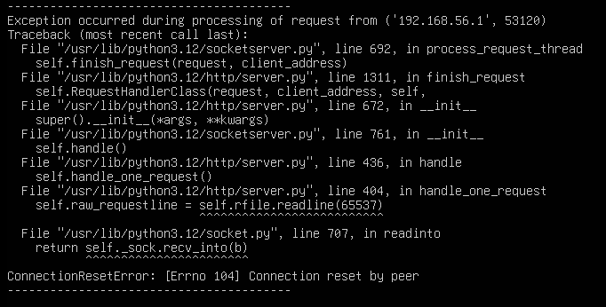

# UFW Firewall and Network Exposure Lab

This lab demonstrates how firewall rules affect network exposure, port visibility, service accessibility, and remote enumeration using UFW, Nmap, SSH, and a simple HTTP service inside an Ubuntu Server virtual machine.

The objective was to understand:

- Host-Only networking
- firewall behavior
- SSH exposure
- service accessibility
- network enumeration
- open, closed, and filtered ports
- HTTP service exposure
- basic offensive security concepts

---

# New Laboratory Topology

The laboratory environment was migrated from a simple NAT forwarding model to a Host-Only segmented network in order to simulate a more realistic infrastructure for enumeration, firewall analysis, and offensive security testing.

The topology used during this lab is illustrated below:



In this architecture:

- NAT remained enabled for internet access inside the VM
- Host-Only networking was used for direct communication between host and virtual machine
- the VM became directly reachable from the host machine
- Nmap scans started reflecting the real VM exposure instead of VirtualBox forwarding rules

---

# Configuring the Host-Only Network

Before attaching the second Host-Only adapter to the VM, a Host-Only network interface needed to be created inside VirtualBox.

**Without this interface the VM would not receive an IPv4 address**

The Host-Only interface was created using the VirtualBox Host Network Manager.



After creating the vboxnet0 interface, the second VM adapter was configured using:

```text
Host-Only Adapter
```

This created a dedicated internal laboratory network between the Linux host machine and the Ubuntu Server VM.

Inside VirtualBox, a Host-Only network interface (`vboxnet0`) was created using the Host Network Manager.



---

# Inspecting Network Interfaces

After booting the VM, the network interfaces were inspected using:

```bash
ip a
```

The interface was manually enabled using:

```bash
sudo ip link set enp0s8 up
```

---

# Obtaining an IPv4 Address

The DHCP client package was installed:

```bash
sudo apt install isc-dhcp-client -y
```

Then a DHCP request was manually performed:

```bash
sudo dhclient enp0s8
```

After this step, the interface received an IPv4 address from the Host-Only network.

```bash
ip a
```

---

# Direct SSH Communication

After migrating to Host-Only networking, SSH access no longer relied on NAT forwarding.

Previously, the environment used:

```text
Host:2222 -> NAT Forwarding -> Guest:22
```

After the migration, the host machine accessed the VM directly through its real Host-Only IP address using native SSH port `22`.

SSH key authentication remained enabled.

---

# Initial UFW Status

Before applying firewall rules, the current UFW status was verified.

Command used:

```bash
sudo ufw status verbose
```

---

# Allowing SSH Access

Since SSH was now exposed directly through the Host-Only network, native SSH port `22` was explicitly allowed.

Command used:

```bash
sudo ufw allow 22/tcp
```

Firewall rules were listed using:

```bash
sudo ufw status numbered
```

---

# Configuring Default Firewall Policies

The firewall was configured to:

- deny all incoming traffic by default
- allow outgoing traffic

Commands used:

```bash
sudo ufw default deny incoming
sudo ufw default allow outgoing
```

Rules were verified again:

```bash
sudo ufw status numbered
```

---

# Enabling UFW

The firewall was enabled after validating the SSH allow rule.

Command used:

```bash
sudo ufw enable
```

Status validation:

```bash
sudo ufw status verbose
```

At this point:

- incoming traffic was denied by default
- outgoing traffic remained allowed
- SSH access through port `22` remained accessible



---

# Enumerating the VM with Nmap

The Ubuntu Server VM was scanned remotely from the Linux host machine using Nmap.

Initially, the host appeared down because ICMP echo requests were filtered.

Nmap suggested using:

```bash
-Pn
```

This option skips host discovery and assumes the target is alive.

Command used:

```bash
nmap -Pn 192.168.56.101
```

Results observed:

- `22/tcp open ssh`
- `2222/tcp closed`
- `8080/tcp closed`
- most remaining ports filtered

---

# Understanding Open, Closed, and Filtered Ports

This scan demonstrated three important port states.

Open:

```text
22/tcp open
```

A service is actively listening and accepting connections.

Closed:

```text
8080/tcp closed
```

The machine is reachable, but no application is listening on that port.

Filtered:

```text
997 filtered tcp ports
```

The firewall silently blocks traffic, reducing visibility from the attacker's perspective.

---

# Exposing an HTTP Service

A simple Python HTTP service was created to simulate a real exposed application.

An HTML file was created:

```bash
echo "SOC LAB Working" > index.html
```

The HTTP server was started using:

```bash
python3 -m http.server 8080
```

---

# Accessing the HTTP Service

The service was remotely accessed from the host machine using:

```bash
curl http://192.168.56.101:8080
```

The response returned:

```text
SOC LAB Working
```

This validated:

- firewall allowance
- service exposure
- remote communication
- HTTP accessibility through the network



---

# HTTP Behavior During Nmap Scanning

During Nmap scanning activity, the Python HTTP server generated exceptions such as:

```text
ConnectionResetError: [Errno 104] Connection reset by peer
```

This occurred because Nmap aggressively opened and interrupted connections while probing the HTTP service.

The HTTP server attempted to continue reading data from connections that had already been terminated.

This demonstrated an important security concept:

- scanners generate observable behavior on the target system
- enumeration activity can produce abnormal logs
- scanning behavior itself may later be detected by monitoring systems, SIEMs, IDSs, or SOC analysts



---

# Final Observations

At the end of the lab, the environment evolved from an isolated NAT virtual machine into a realistic segmented laboratory capable of:

- direct host-to-VM communication
- firewall validation
- remote service exposure
- Nmap enumeration
- HTTP accessibility testing
- offensive and defensive experimentation

This laboratory structure also created the foundation for future studies involving:

- SIEM integration
- log analysis
- intrusion detection
- service fingerprinting
- vulnerability testing
- offensive security workflows
- network monitoring
```
